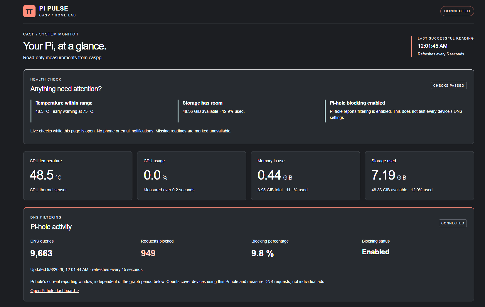
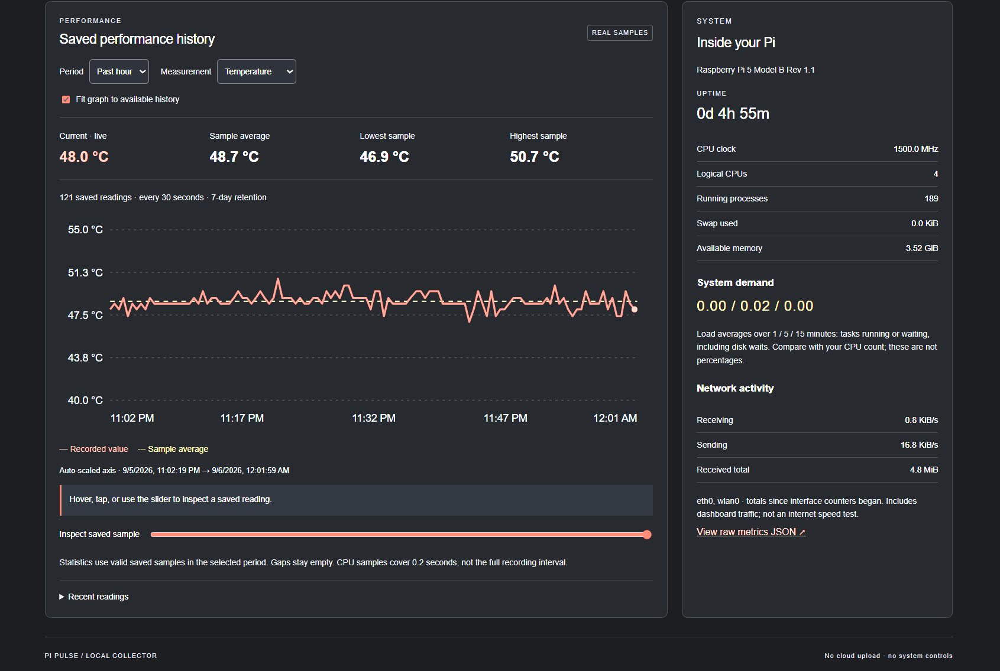
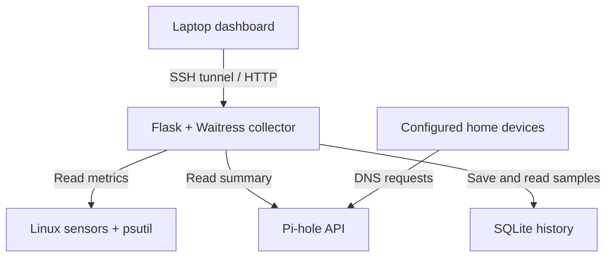

# Pi Pulse

My Raspberry Pi home-lab project: a local dashboard for system health, performance history, and Pi-hole activity.

## Why I started this

I wanted to use my Raspberry Pi for something useful while getting more experience with Linux and networking. I started by setting up Pi-hole to block ads on my laptop and phone. From there, I wanted a way to see what was happening on the Pi without checking everything through the terminal.

Pi Pulse brings the readings together in one dashboard. I can check the temperature, see how much storage is left, look back at performance over time, and see whether Pi-hole is reporting that blocking is enabled.

## What it does

- Shows CPU temperature and usage, memory, storage, uptime, and system details.
- Saves a reading every 30 seconds and keeps seven days of history on the Pi.
- Charts the past hour or day with labeled axes, current values, averages, and minimums and maximums.
- Shows Pi-hole queries, blocked requests, blocking percentage, and blocking status.
- Flags high temperatures, low storage, and disabled or failed blocking.
- Marks missing readings as unavailable instead of displaying misleading zeroes.

## How the project developed

Getting the Pi connected was the first challenge. I worked through Wi-Fi setup, hostname resolution, SSH, and getting a reserved IP address configured on my home router. I then configured my laptop and iPhone to use Pi-hole and checked the query logs to see their requests reaching it.

Once the collector was working, I focused on making the dashboard useful. The original graph was hard to interpret: I wanted to know the current temperature and the average, not just see a moving line. I asked for labeled axes, summary values, and a way to inspect individual readings. Later, I added health checks to the project so problems would be easier to notice.

I also set up automatic startup, a one-click launcher on my laptop, and backups of both Pi-hole and Pi Pulse.

## Saved history

The collector records on the Pi, so I can close my laptop without losing future samples. The browser displays the saved data when I reconnect. In this screenshot, the past-hour sample average was 48.7 °C across 121 readings. These are screenshots from my setup, not live values.

## How it fits together

The collector and Pi-hole both run on the Pi. The dashboard reads their data through an SSH tunnel. DNS requests from my configured devices go directly to Pi-hole; they do not pass through the dashboard.

## My setup

| Part | What I use |
| --- | --- |
| Hardware | Raspberry Pi 5, 4 GB RAM, 64 GB microSD |
| Operating system | Debian-based Linux |
| Collector | Python, psutil, Linux thermal sensor |
| Web service | Flask and Waitress |
| History | SQLite |
| Dashboard | HTML, CSS, JavaScript, SVG |
| DNS filtering | Pi-hole and its v6 API |
| Access and startup | SSH, systemd, Windows launcher |

## Running it

See [setup and operation](docs/operations.md) for dependencies, startup, and Pi-hole connection steps. The Windows launcher is part of my local setup and is distributed separately from this repository.

The collector binds to `127.0.0.1:8765` by default. I use an SSH tunnel to view it from my laptop. It needs to run on the Pi to show that device’s readings.

## Health checks

| Check | Warning | Action needed |
| --- | --- | --- |
| CPU temperature | At least 75 °C | At least 80 °C |
| Main filesystem | At least 85% used or below 3 GiB free | At least 95% used or below 1 GiB free |
| Pi-hole | Blocking disabled | API reports blocking failed |

The 75 °C setting is an early warning. [Raspberry Pi describes throttling beginning at 80 °C](https://www.raspberrypi.com/news/heating-and-cooling-raspberry-pi-5/), but this panel checks temperature rather than directly detecting throttling. The storage thresholds are defaults for this project.

These warnings appear while the dashboard is open; they do not send phone notifications. An unavailable Pi-hole API means the dashboard cannot verify its status, not necessarily that DNS has stopped working.

## What I learned

This project gave me hands-on experience with setting up a headless Linux device, connecting over SSH, configuring DNS, and troubleshooting the difference between the server and the browser. It also made me think more about how to present data clearly.

I wrote up the setup problems and the concepts I’m working through in [my learning notes](docs/learning.md).

## Testing and limits

I checked the dashboard and Pi-hole on my actual setup and noticed fewer ads after configuring my devices. The project also includes automated tests for collection, history, API handling, charts, and health checks. See [testing notes](docs/validation.md).

A few things matter when reading the data:

- CPU readings are 0.2-second samples, not averages of the full recording interval.
- Chart averages use saved samples; the current value comes from a separate live reading.
- Missing periods are not filled in. Network activity is the Pi’s traffic, not an internet speed test.
- Pi-hole blocks domains, so it cannot remove every ad. Blocked DNS requests are not a count of individual ads.

## What I want to try next

- Notifications that reach me when the dashboard is closed.
- Adjustable warning thresholds and alerts for sustained problems.
- Saved Pi-hole trends alongside the system history.
- Testing the backup restore process on spare storage.
- Understanding more of the code so I can make and explain changes independently.

## Development tools

I used ChatGPT/Codex to help write code, troubleshoot problems, and organize documentation. I handled the hardware setup, configuration, deployment, testing on my network, and decisions about what I wanted the dashboard to show.
